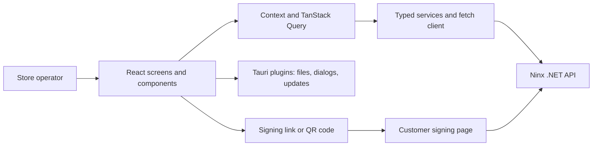

<div align="center">

# Ninx Desktop

**Sales, inventory, and store credit in one desktop workspace for small retailers.**

[](https://github.com/maat-aug/ninx-front/actions/workflows/ci.yml)


[Features](#features) · [Architecture](#architecture) · [Getting Started](#getting-started) · [Tests and Releases](#tests-and-releases)

</div>

Ninx helps small retailers organize daily sales and **store credit (fiado)**: purchases paid for later. This repository is the operator-facing desktop application, built with React and TypeScript inside a Tauri shell and connected to the [Ninx .NET API](https://github.com/maat-aug/ninx-api).

Store staff can manage products and customers, process sales, follow outstanding balances, and present signing links or QR codes to customers. Owners also have reporting and store administration screens. The application interface uses Brazilian Portuguese and local currency formatting.

## Features

| Area | Capabilities |
| --- | --- |
| Point of sale | Product selection, immediate-payment and credit-sale flows, and signature status tracking. |
| Products and stock | Product and category management, inventory views, and stock operations. |
| Customers and credit | Customer records, outstanding credit, repayments, account agreements, and authorized purchasers. |
| Electronic signatures | Links and QR codes that open the customer signing page for documents generated by the API. |
| Reports | Sales, finance, inventory, customer, and store-comparison views with charts and Excel export. |
| Store administration | Store settings, users, roles, permissions, and subscription information. |
| Session management | Login, store selection and switching, password recovery, and permission-aware navigation. |
| Desktop experience | Light and dark themes, native file dialogs, and an integrated application updater. |

## Tech Stack

| Technology | Role |
| --- | --- |
| React 19 / TypeScript 6 | Typed screens, reusable components, and API contracts. |
| Tauri 2 / Rust | Native shell, file access, dialogs, updates, and relaunch support. |
| Vite 8 / Tailwind CSS 4 | Development server, frontend builds, and styling. |
| shadcn/ui / Base UI / Lucide | UI components and icons. |
| TanStack Query | Server-state queries, mutations, and cache invalidation. |
| React Hook Form / Zod | Forms and input validation. |
| React Router | Hash-based routing, lazy-loaded screens, and route guards. |
| Chart.js / react-chartjs-2 / SheetJS | Visual reporting and spreadsheet export. |
| qrcode.react | QR codes for signing links. |
| Node.js test runner | Tests for validation, formatting, masks, and sale-flow helpers. |

## Architecture

The frontend separates screens, shared UI, session state, and API access. Business rules and persistence are handled by the .NET backend; the desktop client translates operator actions into typed requests and presents the results.



<details>
<summary><strong>Source layout and design choices</strong></summary>

```text
src/
  pages/          Sales, customers, inventory, management, and reports
  components/     UI primitives, shared widgets, layout, and update dialog
  context/        Authentication, theme, navigation guard, and updater state
  services/       HTTP client and domain-specific API operations
  types/          Request/response contracts and enums
  hooks/          Permissions, pagination, currency inputs, and updates
  lib/            Validation, formatting, charts, and spreadsheet export
  routes/         Authentication and owner route guards
src-tauri/        Rust shell, desktop capabilities, and packaging configuration
tests/lib/       Tests for frontend helper functions
```

- **Session state:** the JWT is held in memory by the API client. HTTP `401` responses trigger logout; restarting the application requires authentication again.
- **Store switching:** a new store-specific token updates the session and invalidates queries.
- **Permissions:** route guards and permission hooks control what the interface exposes. Authorization is enforced by the API.
- **Native integration:** spreadsheet export uses Tauri file dialogs and file-system access; the updater uses signed release artifacts.
- **Navigation:** `HashRouter` supports routing inside the packaged application, and lazy imports split application screens.

</details>

## Getting Started

### Prerequisites

- Node.js 24 and npm, matching the frontend test workflow.
- A running [Ninx API](https://github.com/maat-aug/ninx-api#readme) and a provisioned user with store access.
- For desktop development: Rust and the platform's Tauri prerequisites. On Windows, these include MSVC C++ Build Tools and WebView2.

### 1. Install dependencies

```bash
git clone https://github.com/maat-aug/ninx-front.git
cd ninx-front
npm ci
```

### 2. Configure the services

Copy `.env.example` to `.env` and replace its hosted service URLs with your local endpoints:

```dotenv
VITE_API_BASE_URL=https://localhost:7093
VITE_SIGNATURE_BASE_URL=http://localhost:8081
```

`VITE_API_BASE_URL` is the API origin, without an `/api` suffix. The services supply route paths themselves. Trust the API's local HTTPS certificate as described in its README, or use its HTTP profile at `http://localhost:5258`.

For signing workflows, run [ninx-signature](https://github.com/maat-aug/ninx-signature#readme) on port `8081` and point its `API_BASE` at the same API. Signing links opened on another device need addresses that device can reach; `localhost` refers to the device opening the link.

### 3. Start the desktop application

```bash
npm run tauri dev
```

Tauri starts Vite at port `1420` through the configured `beforeDevCommand`, then opens the application window.

<details>
<summary><strong>Browser development and production builds</strong></summary>

To work on the web interface in a browser:

```bash
npm run dev
```

Open [localhost:1420](http://localhost:1420). Native operations such as spreadsheet file export and application updates require the Tauri desktop runtime.

To build the frontend or package the native application:

```bash
npm run build
npm run tauri build
```

Desktop packaging requires the platform toolchain. The configuration enables updater artifacts, so signed release builds also need the signing credentials used by the release workflow.

</details>

## API Documentation

The client consumes the separate Ninx API. With the backend's HTTPS profile running, its [Swagger UI](https://localhost:7093/swagger) documents authentication, sales, credit, reports, and signature endpoints.

Frontend contracts live in [`src/types`](src/types), and endpoint calls live in [`src/services`](src/services).

## Tests and Releases

```bash
npx tsc --noEmit
npm test
```

[CI](.github/workflows/ci.yml) installs dependencies, checks types, and runs the Node.js test suite on pushes and pull requests. Tests cover currency helpers, masks, validators, utility functions, and sale-flow decisions.

<details>
<summary><strong>Windows releases and application updates</strong></summary>

The [release workflow](.github/workflows/release.yml) runs on `v*` tags. It checks types and tests before building on Windows and publishing to GitHub Releases.

- The tag supplies the application version through `package.json`.
- Release signing uses the repository secrets `TAURI_PRIVATE_KEY` and `TAURI_KEY_PASSWORD`.
- [`tauri.conf.json`](src-tauri/tauri.conf.json) defines the updater endpoint and public verification key.
- The updater provider checks when the application starts; the update dialog handles the available-update flow.

</details>

## Ninx Ecosystem

| Repository | Responsibility |
| --- | --- |
| [ninx-api](https://github.com/maat-aug/ninx-api) | C#/.NET business rules, authentication, persistence, and documents. |
| **ninx-front** | Desktop workspace for store staff and owners. |
| [ninx-signature](https://github.com/maat-aug/ninx-signature) | Browser-based document signing for customers. |

## Academic Context

Ninx is my Information Systems capstone project (**Trabalho de Conclusão de Curso — TCC**). This desktop application connects my C#/.NET backend work to the daily tasks of a retailer, completing the product with typed frontend integration, reporting, and native distribution.

## License

No license file is currently included in this repository.

## Author

**Matheus Augusto Teixeira Silva** — Information Systems student focused on C# and .NET.

[GitHub](https://github.com/maat-aug) · [LinkedIn](https://www.linkedin.com/in/matheus-augusto-a89348265/)
